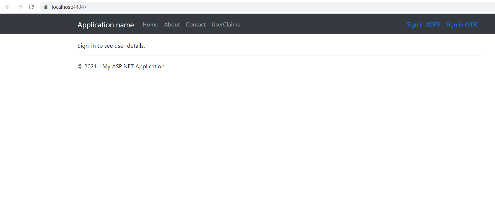
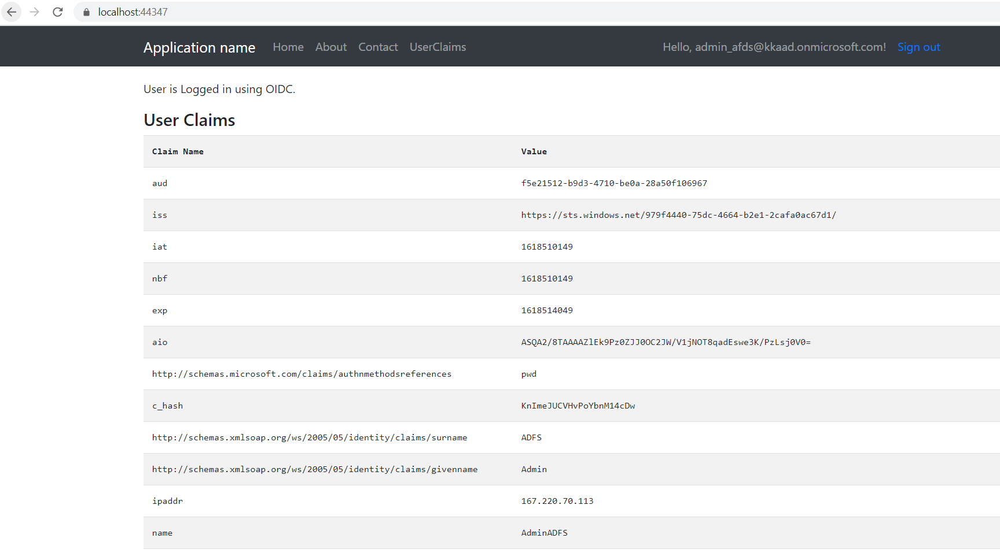
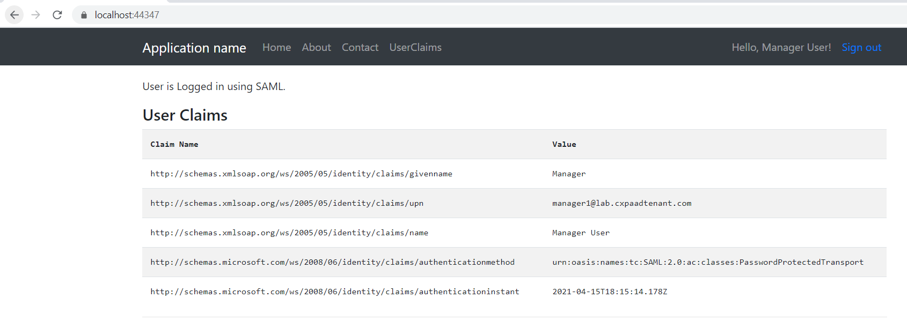

# Signing in users with SAML and OpenID Connect in the same web application

 1. [Overview](#overview)
 1. [Scenario](#scenario)
 1. [Contents](#contents)
 1. [Prerequisites](#prerequisites)
 1. [Setup](#setup)
 1. [Registration](#registration)
 1. [Running the sample](#running-the-sample)
 1. [Explore the sample](#explore-the-sample)
 1. [About the code](#about-the-code)
 1. [Deployment](#deployment)
 1. [More information](#more-information)
 1. [Community Help and Support](#community-help-and-support)
 1. [Contributing](#contributing)


## Overview

This sample shows how in a ASP .NET web applications, we can use the libraries provided by Microsoft to sign-in users using multiple federation protocols.
This particular samples shows using SAML and OpenID Connect in the same web app.
This sample addresses complex scenarios where a developer might have to address multiple protocols when adjusting or incorporating multiple Identity Providers.

## Disclaimer

This sample does not intend to lay down the pattern or foundations of how this complex situation should be approached or done. This is instead provided as a good starting point for developers to start with and experiment further till it meets their eventual needs.

## Scenario

For Azure AD:

The client ASP.NET MVC web app uses the `Microsoft.Owin.Security.OpenIdConnect` to authenticate user using OpenID Connect protocol.

For ADFS:

Application uses the `Microsoft.Owin.Security.WsFederation` library for authenticating user using [SAML](https://docs.microsoft.com/azure/active-directory/develop/single-sign-on-saml-protocol) protocol.

### Prerequisites

> This sample assumes that you already have an on-prem Active Directory and an AD FS environment.

- [Visual Studio](https://visualstudio.microsoft.com/downloads/)
- [.NET Framework 4.7.2](https://dotnet.microsoft.com/download/dotnet-framework)
- A SSL certificate to use during registering the app (Relying Party) on AD FS.
- An **Azure AD** tenant. For more information see: [How to get an Azure AD tenant](https://docs.microsoft.com/azure/active-directory/develop/quickstart-create-new-tenant)
- A user account in your **Azure AD** tenant. This sample will not work with a **personal Microsoft account**. Therefore, if you signed in to the [Azure portal](https://portal.azure.com) with a personal account and have never created a user account in your directory before, you need to do that now.

## Setup

### Step 1: Clone or download this repository

From your shell or command line:

```console
    git clone https://github.com/Azure-Samples/ms-identity-dotnet-adfs-to-aad.git
```

or download and extract the repository .zip file.

> :warning: To avoid path length limitations on Windows, we recommend cloning into a directory near the root of your drive.

## Configuring the sample on Azure AD

### Register the sample application(s) with your Azure Active Directory tenant

There is one project in this sample. To register it, you can:

- follow the steps below for manually register your apps
- or use PowerShell scripts that:
  - **automatically** creates the Azure AD applications and related objects (passwords, permissions, dependencies) for you.
  - modify the projects' configuration files.

<details>
  <summary>Expand this section if you want to use this automation:</summary>

> :warning: If you have never used **Azure AD Powershell** before, we recommend you go through the [App Creation Scripts](./AppCreationScripts/AppCreationScripts.md) once to ensure that your environment is prepared correctly for this step.

1. On Windows, run PowerShell as **Administrator** and navigate to the root of the cloned directory
1. If you have never used Azure AD Powershell before, we recommend you go through the [App Creation Scripts](./AppCreationScripts/AppCreationScripts.md) once to ensure that your environment is prepared correctly for this step.
1. In PowerShell run:

   ```PowerShell
   Set-ExecutionPolicy -ExecutionPolicy RemoteSigned -Scope Process -Force
   ```

1. Run the script to create your Azure AD application and configure the code of the sample application accordingly.
1. In PowerShell run:

   ```PowerShell
   cd .\AppCreationScripts\
   .\Configure.ps1
   ```

   > Other ways of running the scripts are described in [App Creation Scripts](./AppCreationScripts/AppCreationScripts.md)
   > The scripts also provide a guide to automated application registration, configuration and removal which can help in your CI/CD scenarios.

</details>

### Choose the Azure AD tenant where you want to create your applications

As a first step you'll need to:

1. Sign in to the [Azure portal](https://portal.azure.com).
1. If your account is present in more than one Azure AD tenant, select your profile at the top right corner in the menu on top of the page, and then **switch directory** to change your portal session to the desired Azure AD tenant.

### Register the web app (Web-App-ASPNET)

1. Navigate to the [Azure portal](https://portal.azure.com) and select the **Azure AD** service.
1. Select the **App Registrations** blade on the left, then select **New registration**.
1. In the **Register an application page** that appears, enter your application's registration information:
   - In the **Name** section, enter a meaningful application name that will be displayed to users of the app, for example `Web-App-ASPNET`.
   - Under **Supported account types**, select **Accounts in this organizational directory only**.
   - In the **Redirect URI (optional)** section, select **Web** in the combo-box and enter the following redirect URI: `https://localhost:44347/`.
1. Select **Register** to create the application.
1. In the app's registration screen, find and note the **Application (client) ID**. You use this value in your app's configuration file(s) later in your code.
1. In the app's registration screen, select **Authentication** in the menu.
   - If you don't have a platform added, select **Add a platform** and select the **Web** option.
   - In **Implicit grant** section, select the check box for **ID tokens**.
   - In the **Front-channel logout URL** section, set it to `https://localhost:44347/signout-oidc`.
1. Select **Save** to save your changes.
1. In the app's registration screen, select the **API permissions** blade in the left to open the page where we add access to the APIs that your application needs.
   - Select the **Add a permission** button and then,
   - Ensure that the **Microsoft APIs** tab is selected.
   - In the *Commonly used Microsoft APIs* section, select **Microsoft Graph**
   - In the **Delegated permissions** section, select the **User.Read** in the list. Use the search box if necessary.
   - Select the **Add permissions** button at the bottom.

#### Configure the web app (Web-App-ASPNET) to use your app registration

Open the project in your IDE (like Visual Studio or Visual Studio Code) to configure the code.

> In the steps below, "ClientID" is the same as "Application ID" or "AppId".

1. Open the `WebApp_SAML_OIDC\Web.config` file.
1. Find the key `ida:ClientId` and replace the existing value with the application ID (clientId) of `Web-App-ASPNET` app copied from the Azure portal.
1. Find the key `ida:TenantId` and replace the existing value with your Azure AD tenant ID.
1. Find the key `ida:Domain` and replace the existing value with your Azure AD tenant name.

## Configuring the sample on an AD FS server

### Step 1: Add a Relying Party Trust

1. Log into the server in the on-prem Active Directory domain where AD FS is also installed.
1. Open the **Server Manager** Dashboard. Under Tools choose **AD FS Management**
1. Select **Add Relying Party Trust**
1. Click **Start**
1. Choose the option **Enter data about relying party manually** and click **Next**
1. Add a display name, for instance `WebApp_SAML`, and click **Next**
1. Choose the **AD FS profile** option and click **Next**
1. Click **Next** on the Configure Certificate step.
1. Click **Next** on the Configure URL step
1. Under Relying party trust identifier add your application’s web URL (this sample uses `https://localhost:44347`)
1. Click **Add** and then click **Next**
    > For demo purposes, we have an IIS Express development certificate.
1. Click **Next** on the Configure Multi-factor Authentication if needed
1. Click **Next** on the Choose Issuance Authorization Rules if needed
1. Click **Next** on the Ready to Add Trust step if needed.
1. Close the wizard

### Step 2: Adding a Claim Policy

1. On the AD FS Management window, select **Relying Party Trust**
1. Select the application name that you have chosen on the previous step and click **Edit Claim Issuance Policy** on the right menu
1. In the new popup window, click **Add Rule**
1. Choose the Claim rule template as **Send LDAP Attributes as Claims** and click **Next**
1. Add a Claim rule name, for instance `Basic Claims`
1. Select **Active Directory** as the Attribute Store
1. Configure the LDAP attributes to outgoing claim types. Add the above four LDAP attributes and their corresponding outing claim type:
    - E-Mail-Addresses -> Email Address
    - User-Principal-Name -> UPN
    - Given-Name -> Given Name
    - Display-Name -> Name
    - Employee-ID -> EmployeeID
1. [*Optional*] Feel free to map other claims that are relevant in your scenario, like groups and directory extensions
1. Click **Finish**

### Step 3: Configure the .NET MVC application

This sample is using the NuGet package **Microsoft.Owin.Security.WsFederation** to configure the authentication with AD FS.

1. Open the **WebApp_SAML_OIDC** application
1. Open the *Web.config* file and replace the key `ida:ADFSMetadata` value with `https://[enter_your_ADFS_hostname]/federationmetadata/2007-06/federationmetadata.xml`

    For instance:

    ```xml
    <add key="ida:ADFSMetadata" value="https://sts.contoso.com/FederationMetadata/2007-06/FederationMetadata.xml" />
    ```

1. The key `ida:Wtrealm` is the current website URL. Since this sample is running on *localhost*, there is no need to update it.

## Running the sample

> For Visual Studio Users
>
> Clean the solution, rebuild the solution, and run it.

## Explore the sample

1. HomePage displays two Sign-in options.

    

1. Select **Sign-in using OIDC**, after successful sign-in user claims will be displayed on HomePage.

    

1. Select **Sign Out**.

1. Select **Sign-in using SAML (ADFS)**, after successful sign-in user claims will be displayed on HomePage.

    

> :information_source: Did the sample not work for you as expected? Then please reach out to us using the [GitHub Issues](../../../../../issues) page.

## We'd love your feedback!

Were we successful in addressing your learning objective? Consider taking a moment to [share your experience with us](https://forms.office.com/Pages/ResponsePage.aspx?id=v4j5cvGGr0GRqy180BHbR73pcsbpbxNJuZCMKN0lURpUODFCRVg4VTk2QUE2VEFPMUZKSEJNUFhWUyQlQCN0PWcu).

We're always listening, and if you want to get in touch with you directly, send an email to <aadappfeedback@microsoft.com>.

## About the code

1. In `Startup.cs`, update ConfigureAuth method to add authentication middleware.

    Below lines of code adds OpenID Connect authentication middleware:

    ```csharp
    app.UseOpenIdConnectAuthentication(
        new OpenIdConnectAuthenticationOptions
        {
            ClientId = clientId,
            Authority = authority,
            PostLogoutRedirectUri = postLogoutRedirectUri,
            Notifications = new OpenIdConnectAuthenticationNotifications()
            {
                SecurityTokenValidated = context =>
                {
                    var identity = context.AuthenticationTicket.Identity;
                    Claim claim = new Claim(Constants.AuthenticationType, OpenIdConnectAuthenticationDefaults.AuthenticationType);
                    identity.AddClaim(claim);
                    return Task.FromResult(0);
                }
            }
        });
    ```

    On SecurityTokenValidated event, a claim with name "AuthenticationType" is added in the claims collection to verify if the user has logged-in using OIDC or SAML.

    Below lines of code adds WsFederation authentication middleware:

    ```csharp
    app.UseWsFederationAuthentication(
        new WsFederationAuthenticationOptions
        {
            Wtrealm = realm,
            MetadataAddress = adfsMetadata,
            Wreply = "https://localhost:44347/"
         });
    ```

1. In `AccountController.cs`, SignIn method gets an input parameter and on the basis of that parameter use the required authentication protocol.

    ```csharp
    public void SignIn(bool isOIDC)
    {
        if (!Request.IsAuthenticated)
        {
            if (isOIDC)
            {
                HttpContext.GetOwinContext().Authentication.Challenge(new AuthenticationProperties { RedirectUri = "https://localhost:44347/" },
                OpenIdConnectAuthenticationDefaults.AuthenticationType);
            }
            else
            {
                HttpContext.GetOwinContext().Authentication.Challenge(new AuthenticationProperties { RedirectUri = "https://localhost:44347/" },
                    WsFederationAuthenticationDefaults.AuthenticationType);
            }
        }
    }
    ```

    SignOut method checks AuthenticationType claim and sign-out the user on the basis of that claim.

    ```csharp
    public void SignOut()
    {
        string callbackUrl = Url.Action("SignOutCallback", "Account", routeValues: null, protocol: Request.Url.Scheme);
        
        var claimsIdentity = (ClaimsIdentity)User.Identity;
        var claim = claimsIdentity.FindFirst(Constants.AuthenticationType);
     
        if (claim != null && claim.Value == OpenIdConnectAuthenticationDefaults.AuthenticationType)
        {
            HttpContext.GetOwinContext().Authentication.SignOut(
            new AuthenticationProperties { RedirectUri = callbackUrl },
            OpenIdConnectAuthenticationDefaults.AuthenticationType, CookieAuthenticationDefaults.AuthenticationType);
        }
        else
        {
            HttpContext.GetOwinContext().Authentication.SignOut(
                new AuthenticationProperties { RedirectUri = callbackUrl },
                WsFederationAuthenticationDefaults.AuthenticationType, CookieAuthenticationDefaults.AuthenticationType);
        }
    }
    ```

## More information

- [Moving application authentication from AD FS to Azure Active Directory](https://docs.microsoft.com/azure/active-directory/manage-apps/migrate-adfs-apps-to-azure)
- [AD FS to Azure AD App Migration Tool](https://github.com/AzureAD/Deployment-Plans/blob/master/ADFS%20to%20AzureAD%20App%20Migration/Readme.md)
- [Configure SAML-based single sign-on to non-gallery applications](https://docs.microsoft.com/azure/active-directory/manage-apps/configure-single-sign-on-non-gallery-applications)
- [Microsoft identity platform (Azure Active Directory for developers)](https://docs.microsoft.com/azure/active-directory/develop/)
- [Overview of Microsoft Authentication Library (MSAL)](https://docs.microsoft.com/azure/active-directory/develop/msal-overview)
- [Quickstart: Register an application with the Microsoft identity platform (Preview)](https://docs.microsoft.com/azure/active-directory/develop/quickstart-register-app)

## Community Help and Support

Use [Stack Overflow](http://stackoverflow.com/questions/tagged/msal) to get support from the community.
Ask your questions on Stack Overflow first and browse existing issues to see if someone has asked your question before.
Make sure that your questions or comments are tagged with [`azure-active-directory` `azure-ad-b2c` `ms-identity` `adal` `msal`].

If you find a bug in the sample, raise the issue on [GitHub Issues](../../../../../issues).

To provide feedback on or suggest features for Azure Active Directory, visit [User Voice page](https://feedback.azure.com/forums/169401-azure-active-directory).

## Contributing

If you'd like to contribute to this sample, see [CONTRIBUTING.MD](/CONTRIBUTING.md).

This project has adopted the [Microsoft Open Source Code of Conduct](https://opensource.microsoft.com/codeofconduct/). For more information, see the [Code of Conduct FAQ](https://opensource.microsoft.com/codeofconduct/faq/) or contact [opencode@microsoft.com](mailto:opencode@microsoft.com) with any additional questions or comments.
