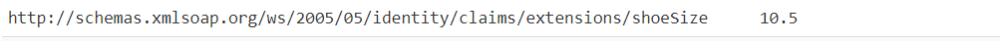

# Migrating a .NET MVC Web application from ADFS to Azure Active Directory

## Scenario

In this chapter, we learn how applications that user SAML as their chosen authentication method and currently integrated with an Active Directory Federation Services (ADFS) instance can successfully be migrated with all of their dependencies and configuration to an Azure Active Directory tenant.

### About the sample

Here we provide you with an ASP.NET web application that uses the SAML protocol to authenticate users. We'd first register this web app with an ADFS instance and then move on to register (migrate) this application to the Azure AD tenant that's connected to the on-prem Active Directory domain of this ADFS instance.

### Pre-requisites

> This sample assumes that you already have an on-prem Active Directory and an ADFS environment.

- [Visual Studio](https://aka.ms/vsdownload)
- .NET Framework 4.7.2
- An Internet connection
- A SSL certificate to use during registering the app (Relying Party) on ADFS.
- An Azure Active Directory (Azure AD) tenant. For more information on how to get an Azure AD tenant, see [How to get an Azure AD tenant](https://azure.microsoft.com/documentation/articles/active-directory-howto-tenant/)

### Setup Azure AD Connect

For users of your on-prem Active directory to successfully sign-in to their Azure Active Directory tenant, you need to have an Azure AD Connect setup. If you don;t have it set-up, consider [downloading and installing Azure AD Connect](https://www.microsoft.com/download/details.aspx?id=47594).

Configure the [Azure AD Connect](https://docs.microsoft.com/azure/active-directory/hybrid/how-to-connect-sync-whatis) to sync with the tenant that you want to migrate to, using the wizard provided in the tool.

## Chapter 1: Configuring the sample on your ADFS

### Step 1: Adding a Relying Party Trust

1. Log into the server in the Active Directory domin where ADFS is also installed.
1. Open the Server Manager Dashboard. Under Tools choose **ADFS Management**
1. Select **Add Relying Party Trust**
1. Click **Start**
1. Choose the option **Enter data about relying party manually** and click **Next**
1. Add a display name, for instance `WebApp_SAML`, and click **Next**
1. Choose the **ADFS profile** option and click **Next**
1. Click **Next** on the Configure Certificate step [TODO: not add certificate??]
1. Click **Next** on the Configure URL step
1. Under Relying party trust identifier add your application’s web URL (this sample uses `https://localhost:44347`)
1. Click **Add** and then click **Next**
. For demo purposes, we have an IIS Express development certificate.
1. Click **Next** on the Configure Multi-factor Authentication step
1. Click **Next** on the Choose Issuance Authorization Rules step
1. Click **Next** on the Ready to Add Trust step
1. Close the wizard

### Step 2: Adding a Claim Policy

1. On ADFS Management window, select *Relying Party Trust*
1. Select the application name that you have chosen on the previous step and click **Edit Claim Issuance Policy** on the right menu
1. In the new popup window, click **Add Rule**
1. Choose the Claim rule template as **Send LDAP Attributes as Claims** and click **Next**
1. Add a Claim rule name, for instance `Basic Claims`
1. Select **Active Directory** as the Attribute Store
1. Configure the LDAP attributes to outgoing claim types. Add the above four LDAP attributes and their corresponding outing claim type:
    - E-Mail-Addresses -> Email Address
    - User-Principal-Name -> UPN
    - Given-Name -> Given Name
    - Display-Name -> Name
1. [Optional] Feel free to map other claims that are relevant in your scenario
1. Click **Finish**

### Step 3: Configure the .NET MVC application

This sample is using the NuGet package **Microsoft.Owin.Security.WsFederation** to configure the authentication with ADFS.

1. Open the **WebApp_SAML** application
1. Open the `Web.config` file and replace the key `ida:ADFSMetadata` value with your ADFS FederationMetadata.xml URI. For instance:

```xml
    <add key="ida:ADFSMetadata" value="https://sts.contoso.com/FederationMetadata/2007-06/FederationMetadata.xml" />
```

1. The key `ida:Wtrealm` is the current website URL. Since this sample is running on *localhost*, there is no need to update it.

Run the **WebApp_SAML** application and sign-in using an ADFS user.

Before we move to the next step, please make sure of the following:

1. The web app can sign in users from the on-prem Active Directory.
2. The claims in the tokens issued are the ones that you expect in your production app(s).

## Chapter 2: Migrate this sample to Azure AD

As a first step you'll need to:

1. Sign in to the [Azure portal](https://portal.azure.com) using either a work or school account or a personal Microsoft account.
1. If your account is present in more than one Azure AD tenant, select your profile at the top right corner in the menu on top of the page, and then **switch directory**.
   Change your portal session to the desired Azure AD tenant where you want to migrate the SAML application.

### Registering the SAML application in Azure AD

1. Navigate to the Microsoft identity platform for developers [Enterprise applications](https://portal.azure.com/#blade/Microsoft_AAD_IAM/ActiveDirectoryMenuBlade/EnterpriseApps) page.
1. Select **New registration**.
1. Select **Non gallery app**.
1. Choose a name for the application, for instance `WebApp_SAML` and select **Add** on the bottom.
1. Under the Manage section, select **Single sign-on**.
1. Select **SAML**. The **Set up Single Sign-On with SAML** page appears.

#### Basic SAML configuration for your app

For detailed information about the configuration, please follow [this doc](https://docs.microsoft.com/azure/active-directory/manage-apps/configure-single-sign-on-non-gallery-applications)

1. To edit the basic SAML configuration options, select the **Edit** icon (a pencil) in the upper-right corner of the Basic SAML Configuration section.
1. Set **Identifier (Entity ID)** with an unique URL that follows the pattern, `http://.contoso.com`. For instance: `http://webappsaml.contoso.com`.
1. Set **Reply URL** with the URL that AAD will reply after the authentication. In our sample we are using `https://localhost:44347/`.
1. [Optional] Set the other parameters with values according to your scenario. the guide [Moving application authentication from Active Directory Federation Services to Azure Active Directory](https://docs.microsoft.com/azure/active-directory/manage-apps/migrate-adfs-apps-to-azure) is an excellent resource to learn about the various available options.

#### SAML Signing Certificate

1. In the **SAML Signing Certificate** section, copy the value for `App Federation Metadata Url`. We will use it on the Web App project.

#### [Optional] User Attributes and Claims

1. In the **User Attributes and Claims** section, select the **Edit** icon (a pencil) in the upper-right corner.
1. Add additional claims that you would like to use in the Web App project.
1. To add a claim, select **Add new claim** at the top of the page. Enter the Name and select the appropriate source.
1. Select **Save**. The new claim appears in the table.

#### Configuring the Web App project

Open the project `Web.config` file and:

1. Replace the value for `ida:ADFSMetadata` with the link that you copied from **App Federation Metadata Url** field.
2. Replace the value for `ida:Wtrealm` with the value that you set for **Identifier (Entity ID)**. For instance, `http://webappsaml.contoso.com`.

Run the **WebApp_SAML** application and sign-in using a ADFS user or a user from your AAD tenant.

### Sync Directory Extensions [Optional]

While groups and claims will usually be set to sync to Azure AD using Azure AD Connect tool, any **Directory Extensions** you have need to sync's via the Azure AD Connect.

If your ADFS doesn't have Directory Extensions but you would like to have a few to say try this chapter in depth, please follow [this tutorial](https://social.technet.microsoft.com/wiki/contents/articles/51121.active-directory-how-to-add-custom-attribute-to-schema.aspx) to create an extension.

#### Configuring Azure AD Connect for Directory Extensions

1. Open the Azure AD Connect tool and select **Configure**
2. Select the option **Customize synchronization options** and click **Next**
3. Sign-in with your AAD global administrator user
4. Select **Next** on the *Connect your directories* tab
5. Select **Next** on the *Domain and OU filtering* tab
6. Check the box **Directory extension sync** and click **Next**
7. The following screen will show all the available attributes in your ADFS. Move to the right box all the attributes that you would like to send to AAD
8. Click **Next** and the synchronization will be executed.

#### Testing the directory extensions synchronization

To test the migration, you can access [Graph Explorer](https://aka.ms/ge), sign-in using an ADFS user that has those attributes set.

Once signed-in and accepted the consent screen, run the query for the URL: `https://graph.microsoft.com/beta/me`, and the attributes will be listed in the result.

>Note: When you sync directory attributes via Azure AD Connect tool, their name on Microsoft Graph will have an auto-generated prefix that **cannot be edited**. For instance, if you have an attribute called `shoeSizeAttribute` and use the tool so sync it with Azure AD, its name will be transformed to something like: `extension_90f5761cbd854b259d47fde20b522087_shoeSizeAttribute`

#### Adding Directory Extension attributes to AAD SAML claims

Once you have synced the Directory Extensions using Azure AD Connect tool, you can configure your SAML application to include these extensions in the claims. For it, please follow the steps:

1. Sign in to the [Azure portal](https://portal.azure.com).
1. Navigate to the Microsoft identity platform for developers [Enterprise applications](https://portal.azure.com/#blade/Microsoft_AAD_IAM/ActiveDirectoryMenuBlade/EnterpriseApps) page. 
1. Search for the application that we have previously configured, for instance `WebApp_SAML` and select it.
1. On the left blade, select **Single Sign-on**.
1. In the **User Attributes and Claims** section, select the **Edit** icon (a pencil) in the upper-right corner.
1. Select **Add new claim**.
1. On the **Name** field, type the desired name for the claim. For instance, `shoeSize`.
1. On the **Namespace** field, type the desired namespace for the new claim. For instance, `http://schemas.xmlsoap.org/ws/2005/05/identity/claims/extensions`.
1. On the **Source** field, select **Attribute**.
1. On the **Source Attribute** field, select the synced Directory Extension that you would like to set for this new claim.
1. Select **Save**.

#### Testing the application

Run the same SAML application project, `WebApp_SAML`, that you have migrated to AAD, and you will see the new claim listed on the homepage:



>NOTE: If the user signed-in doesn't have a value for the claim, it won't be listed in the claims list.

## Using on-prem Security Groups

All the groups listed in the ADFS `Synced OU/Groups` folder, will be migrated to AAD with the Azure AD Connect tool. The group members will also be automatically set in the AAD side by the tool.

In this chapter we are going to explain how to bring the synced groups to the SAML web application claims.

### Adding Group Claims

Assuming that you already have your SAML application configured in your AAD tenant, navigate to its **Single Sign-on** blade and follow the steps bellow.

>NOTE: If you haven't configured the SAML application yet, please go to [Chapter 1](#registering-the-saml-application)

1. Navigate to the Microsoft identity platform for developers [Enterprise applications](https://portal.azure.com/#blade/Microsoft_AAD_IAM/ActiveDirectoryMenuBlade/EnterpriseApps) page.
1. Search for the application that we have previously configured, for instance `WebApp_SAML` and select it.
1. On the left blade, select **Single Sign-on**.
1. In the **User Attributes and Claims** section, select the **Edit** icon (a pencil) in the upper-right corner.
1. Select **Add a group claim**.
1. For the group association field, select **Security Group**.
1. For **Source Attribute** field, select **sAMAccountName**.
1. [Optional] If you want to customize the claim, check the box for **Customize the name of the group claim** and fill the inputs according to your customization.

### Test groups claims in the application

Run the Azure AD integrated `WebApp_SAML` project, sign-in a user, and should be able see that the user's groups listed in the claims:


## Chapter 3: Migrating the AAD application from SAML to OpenIdConnect(OIDC)

TODO: Provide links about SAML and OIDC
TODO: No additional nuget packages are needed??
TODO: provide one link to claims customization, using groups and using roles. 

- Change the code from `app.UseWsFederationAuthentication` to `app.UseOpenIdConnectAuthentication`
- Set metadata to app specific one due to JWT Signing Keys, `https://login.microsoftonline.com/979f4440-75dc-4664-b2e1-2cafa0ac67d1/.well-known/openid-configuration?appid=d3fe55db-31dd-4d85-8d18-06fb7219766f`.

### Useful resources

- [Moving application authentication from ADFS to Azure Active Directory](https://docs.microsoft.com/azure/active-directory/manage-apps/migrate-adfs-apps-to-azure)
- [Configure SAML-based single sign-on to non-gallery applications](https://docs.microsoft.com/azure/active-directory/manage-apps/configure-single-sign-on-non-gallery-applications)